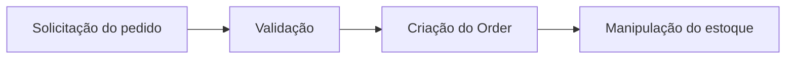
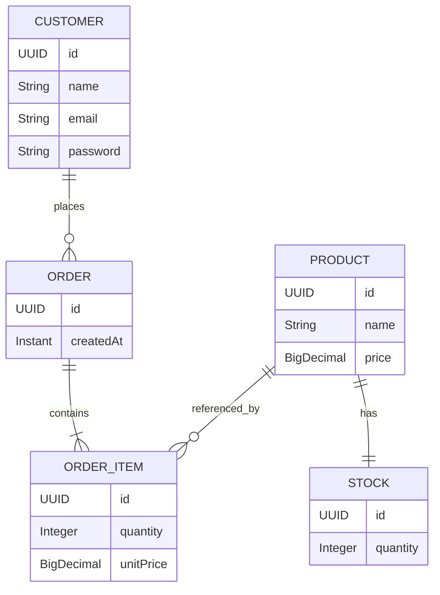

# 🛒 CommerceHub

**CommerceHub** é uma aplicação backend de e-commerce desenvolvida com **Java e Spring Boot**, criada para praticar modelagem de domínio, regras de negócio, persistência, testes e arquitetura de aplicações.

> 🚧 **Projeto em desenvolvimento**

---

## 🧰 Stack

| Tecnologia          | Uso                      |
| ------------------- | ------------------------ |
| ☕ Java 21           | Linguagem principal      |
| 🍃 Spring Boot      | Framework                |
| 🗄️ Spring Data JPA | Persistência             |
| 🐘 PostgreSQL       | Banco de dados           |
| 🔄 Flyway           | Versionamento do banco   |
| 🧪 JUnit 5          | Testes                   |
| 🎭 Mockito          | Mocks e testes unitários |
| 📦 Maven            | Gerenciamento do projeto |

---

## 🚀 Funcionalidades

### 👤 Customer

* Cadastro de clientes
* Busca por ID
* Busca por e-mail
* Listagem de clientes
* Atualização de dados
* Remoção de clientes

### 📦 Product

* Cadastro e gerenciamento de produtos
* Controle de preço
* Validações de domínio

### 📊 Stock

* Controle de quantidade disponível
* Validação de disponibilidade
* Redução de estoque

### 🛍️ Order

* Criação de pedidos
* Composição através de `OrderItem`
* Cálculo do valor total
* Associação com cliente e produtos
* Validação das regras de negócio

---

## 🧠 Order Workflow

O fluxo de criação de pedidos está sendo desenvolvido seguindo uma abordagem simples e orientada às regras de negócio:



### Princípios atuais

* Um pedido precisa possuir um cliente.
* Um pedido precisa possuir pelo menos um item.
* Cada `OrderItem` referencia um produto.
* A quantidade solicitada deve estar disponível no estoque.
* O pedido é criado antes da redução do estoque.
* O valor do item é baseado no preço do produto no momento da criação.
* O estado do pedido ainda não faz parte do domínio atual.

> A arquitetura será evoluída conforme novas necessidades forem introduzidas, evitando complexidade prematura.

---

## 🏗️ Estrutura

```text
commercehub
└── src
    ├── main
    │   ├── java
    │   │   └── com.italoccosta.commercehub
    │   │       ├── domain
    │   │       ├── repository
    │   │       ├── service
    │   │       └── controller
    │   │
    │   └── resources
    │       ├── application.properties
    │       ├── application-dev.properties
    │       └── db
    │           └── migration
    │
    └── test
```

A aplicação utiliza uma **arquitetura em camadas**, mantendo responsabilidades separadas entre domínio, serviços, persistência e API.

---

## 🗃️ Modelo de domínio



---

## 🧪 Testes

O projeto utiliza diferentes níveis de teste conforme a responsabilidade da classe:

* **Unit tests** para regras de negócio e services
* **Integration tests** para persistência com JPA
* Mockito para isolamento das dependências nos testes unitários

A estratégia é testar o comportamento da aplicação, não apenas aumentar cobertura de código.

---

## 🗄️ Banco de dados

O PostgreSQL é utilizado como banco principal.

As alterações de schema são controladas pelo **Flyway**:

```text
V1 → Product / Stock
V2 → Customer
V3 → Order / OrderItem
```

---

## ▶️ Executando localmente

### Pré-requisitos

* Java 21
* PostgreSQL
* Maven

### Executar

Utilizando o profile `dev`:

```bash
./mvnw spring-boot:run "-Dspring-boot.run.profiles=dev"
```

A aplicação será iniciada em:

```text
http://localhost:8080
```

---

## 🗺️ Roadmap

* [x] Customer
* [x] Product
* [x] Stock
* [x] Order
* [x] OrderItem
* [x] DTOs
* [x] Database migrations
* [x] Repository tests
* [x] Service tests
* [x] Order Workflow
* [ ] REST Controllers
* [ ] API validation
* [ ] Exception handling
* [ ] Authentication & Authorization
* [ ] API documentation
* [ ] RabbitMQ
* [ ] Seller domain

---

## 🎯 Objetivo

O CommerceHub é um projeto de **portfólio e aprendizado**, com foco no desenvolvimento backend utilizando Java.

Mais do que implementar funcionalidades, o projeto busca explorar decisões reais de desenvolvimento, como:

* modelagem de domínio;
* orientação a objetos;
* encapsulamento;
* regras de negócio;
* persistência;
* transações;
* testes;
* tratamento de exceções;
* evolução arquitetural.

A complexidade do projeto será aumentada gradualmente, conforme novas necessidades surgirem.

---

## 📌 Status

**Em desenvolvimento ativo.**

Novas funcionalidades e decisões arquiteturais são adicionadas incrementalmente conforme a evolução do projeto.
